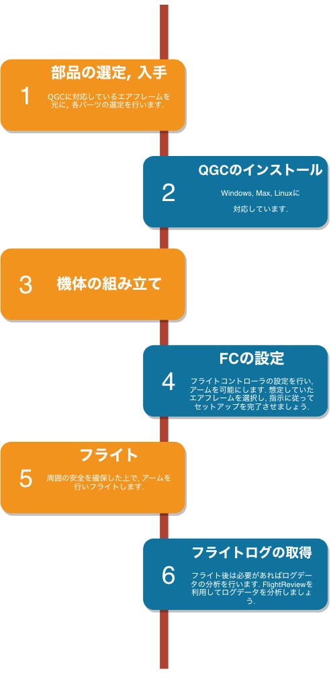
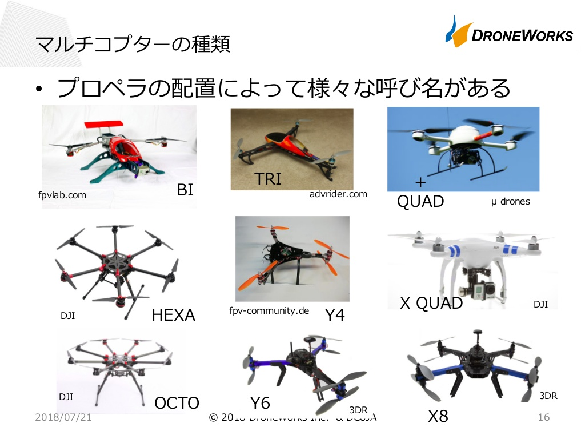
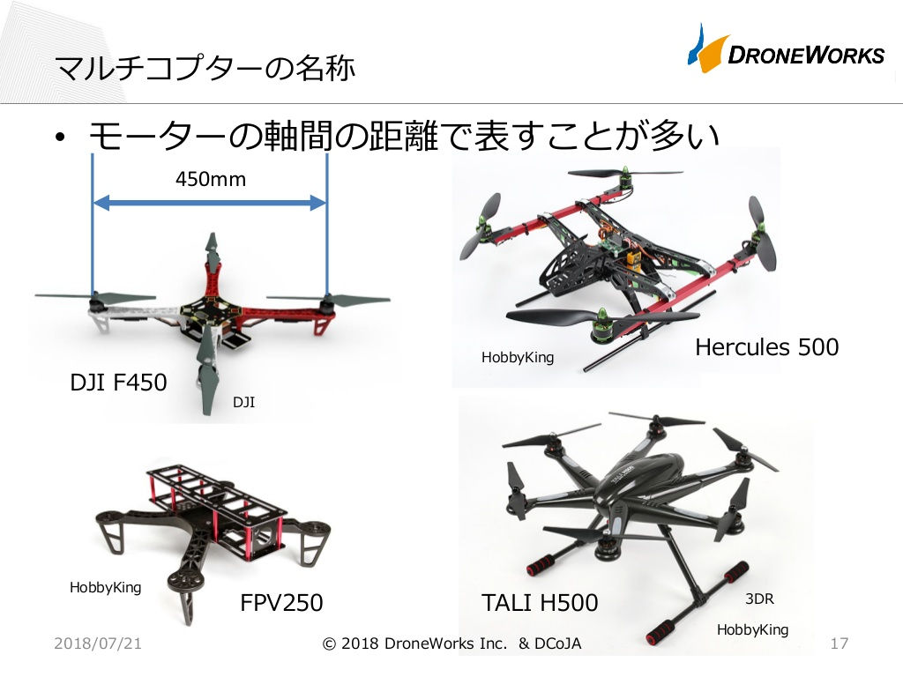

# QGroundControlを使ってドローンを最短でセットアップしたい人向けのマニュアル

## はじめに

### QGroundControlって何？

GCS(Ground Control Station)と呼ばれるソフトウェアで, 地上から機体制御ゲインの調整や飛行経路の設定ができるソフトです. 
APMのMissionPlannerや, DJIのGS PROが同レイヤーのソフトウェアとして挙げられます. ドローンをフライトさせるために, 必要なソフトウェアだと認識しておけばいいでしょう.

### 困ったときは
躓いたときはQGCのリファレンスページを参照しましょう.  
ユーザーガイドかデベロッパーガイドを見れば大抵のことは解決するはず(?)  
[PX4 User Guide](https://docs.px4.io/en/) 
[PX4 Development Guide](https://dev.px4.io/en/)

- 注意点
  - QGCはオープンソースプロジェクトなのでバージョンが更新されていきます. 利用しているファームウェアバージョンと同じバージョンのリファレンスを参照しましょう.(現 stable -v1.8.2)
  - 想定外のエラーに遭遇した際はリファレンスを見ても解決しない場合が多いので, 検索エンジンの利用を推奨します. 

## フライトログ取得までのフローチャート

フローチャートの手順で進めるとスムーズ.

### パーツの役割と選定
ドローン製作にあたって必要なパーツは以下の通り. 
パーツの役割や選び方知っておくと後々役に立つかも. 
~~写真はイメージ.~~
*はPixhawk付属品

- フライトコントローラー(FC)*
  - Pixhawk 2.4.x(本マニュアル推奨FC)
  - [いろんなFCがある](http://shiguregaki.com/?p=887)

- GPS モジュール*
  - I2C通信で接続
  
- Switch　モジュール*
- Buzzer モジュール*
  - うるさいやつ
  - 設定やアーム, フライトモードを変更したときにここから音が鳴る(騒音)
- Power モジュール*
  - 電池の配線を分配し, FCへの給電5Vとモータへの給電ができる.
- telemetly モジュール
  - 必須ではないが, あると便利.
  - USB接続せずPCから遠隔で設定やフライト, 機体情報の確認が可能になる. 
  - Pixhawk側とPC側でそれぞれ取り付け
  - PC側にドライバのインストールが必要(?)
- PitotTube
  - 対気速度計
  - 必須ではないが, 飛行機形状のエアフレームを利用する場合必要になる.
  - I2C通信で接続
  - I2C接続口は一つしかないのでI2Cスプリッターを使ってGPSとPitotTubeを接続する

- 機体フレーム
  - 軽くて丈夫だと◎
  - [よく見るやつ](https://www.dji.com/jp/flame-wheel-arf/feature)

- モータ用アンプ(ESC)
  - 一つのモータに一つのアンプが必要.
  - モータに必要なAにあったアンプを選定.
  - 最大Aの足りなかったり, 余裕のないアンプを選ぶと燃えたり墜落するので注意.

- ブラシレスモーター
  - 機体の重量から必要推力を考慮→モータの選定
  - [仕組み](https://www.orientalmotor.co.jp/tech/teruyo/vol32/)
  - [選び方1](http://japandronelicense.com/blog/how-to-choose-drone-mortor/)
  - [選び方2](https://droneport-uav.com/?p=159)

- プロペラ
  - [プロペラの諸元表記について](https://otonaradicon.com/%E3%83%89%E3%83%AD%E3%83%BC%E3%83%B3%EF%BC%88%E3%83%9E%E3%83%AB%E3%83%81%E3%82%B3%E3%83%97%E3%82%BF%E3%83%BC%EF%BC%89%E3%81%AE%E3%83%97%E3%83%AD%E3%83%9A%E3%83%A9%E3%82%B5%E3%82%A4%E3%82%BA/)
  - 劣化や破損で交換が必要になるので予備があると◎
- 電池
  - LiPo(リチウムポリマー電池が一般的)
  - 重さ, セル数(電圧), 容量が重要

- 受信機
  - プロポと信号の送受信をするモジュール
  - チャンネル数は基本的に5~
  - PWM信号([参考](http://www.kairo-nyumon.com/pwm_signal.html))

- PPM Encoder
  - 受信機が受信した信号を1本にまとめる

- プロポ(ラジコン用送信機)
  - 製品マニュアルを見れば大体のことは解決

### QGroundControlのインストール

公式サイトからダウンロードしてパソコンにインストール.   
Windows/Mac/Linux/Android/iOS対応 
[qgroudcontrol.com](http://qgroundcontrol.com/)

※Windowsが無難

### 組み立て

選択するエアフレームの[リファレンス](https://docs.px4.io/en/airframes/airframe_reference.html)を参照して配線. 
本体側のRCピンにはPPMEncoderを配線. 
CW, CCWはモータの回転方向の指定([参照](https://www.orientalmotor.co.jp/tech/glossary/eng03/)). 

### QGCでフライトコントローラのセットアップ

- ファームウェアの選択
  - PixhawkをPCに接続し, `PX4 Flight Stack v1.8.2 Stable Release`を選択
  - ファームウェアを選択すると, 各項目が赤く変化
  - 赤い項目をクリアしていくことでアームが可能に

##### Airframe

利用したいAirframeを選択し, `Apply and Restart`を押下

##### Sensor
センサごとに押下し, 指示に従いキャリブレーションを実行する

##### Radio
受信機からプロポの信号が入力されている場合, Channel Monitorのポインターが動作する.  
入力を確認後, Modelを選択し, 指示に従いプロポのキャリブレーションを行う.

###### キャリブレーション(補足)

      キャリブレーション（較正, 校正）は, 計器を基準に整合するよう調整する工程です. 
      通常キャリブレーションをしていない状態でのフライトはできません.

      QGroundControlでは, 
      - Compass
      - Gyroscope
      - Accelerometer
      - Level Horizon
      - (Airspeed)

      のセンサーキャリブレーションと, ラジオ(プロポ)のキャリブレーションが必要になります.
      (Airspeedは対気速度が必要になるAirframeを選択するとピトー管の取り付けと, キャリブレーションが必要になります.)
      また, ブラシレスモータの制御を行うESC(アンプ)のキャリブレーションも必要になります.

##### Flight Modes
- フライトモードとアームのスイッチをchannelに割り当てる必要がある. 
- 基本的に, プロポの操舵を行うスティック以外のチャンネルに割りあてる. 
- 遷移飛行を行うAirframeでは, トランジションスイッチも割り当てる必要がある.

##### Power
- バッテリの設定は必須ではないため省略.
- `ESC PWM Minimum and Maximum Calibration`の項目で, ESCのキャリブレーションをまとめて行うことができる（簡単なのでおすすめ） 
- ※ESCごとにキャリブレーションを行うこともできる(ESCの説明書に記述)

### フライト
作ったドローンをフライトさせるためには, いくつかの準備が必要です.

- アーム
- バッテリ残量の確認
- 周囲の状況確認
  - 風速
  - 天候

##### アーム
- 機体を飛ばせる場所まで移動させ,　機体や周囲に危険がないか確認したら, アームを行います. 
- Switchモジュールを長押し後, アームスイッチを入れることでアームできます. 
- アームするとスロットルへの入力が入るようになります. 

**Let's flight.**

### フライトログの取得

Pixhawkでは, microSDを挿入しておくだけでフライトログが取得できます.  
QGroundControlは, 独自の分析ビューを開発しているので, これを利用します.  
取得したフライトログ(拡張子:ulg)データを[Flight Review](https://review.px4.io/)にアップロードすることでログの分析が可能です. 
(ulgファイルはcsvに変換可能なのでエクセルでグラフ化することもできます)

# おまけ

## マルチコプターの種類と名称 

